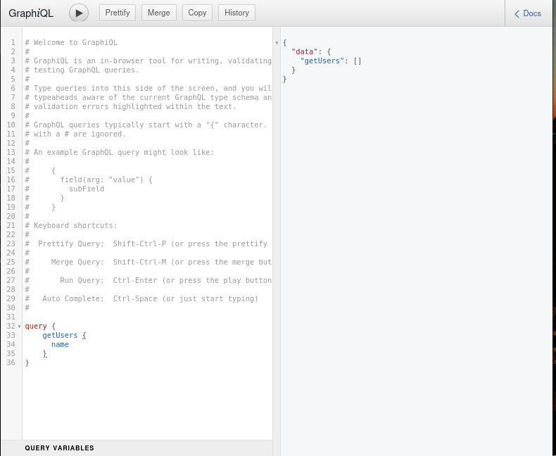

# Grahql api with nodejs

Simple graphQl api using nodeJs



## Installation

```bash
npm install --legacy-peer-deps
node index.js
```

## Usage

```javascript
const query = `
query {
    getUsers() {
      name
    }
  }
`

fetch("https://localhst:3000/", {
  method: "POST",
  headers: {
    "Content-Type": "application/json",
  },
  body: JSON.stringify({ query }),
})
  .then((response) => response.json())
  .then((data) => console.log(data))
  .catch((error) => console.error("Erreur:", error));
```

## Technologies

- NodeJs
- GraphQl
- Express
- MongoDB
- Mongoose

## License

[MIT](https://choosealicense.com/licenses/mit/)
